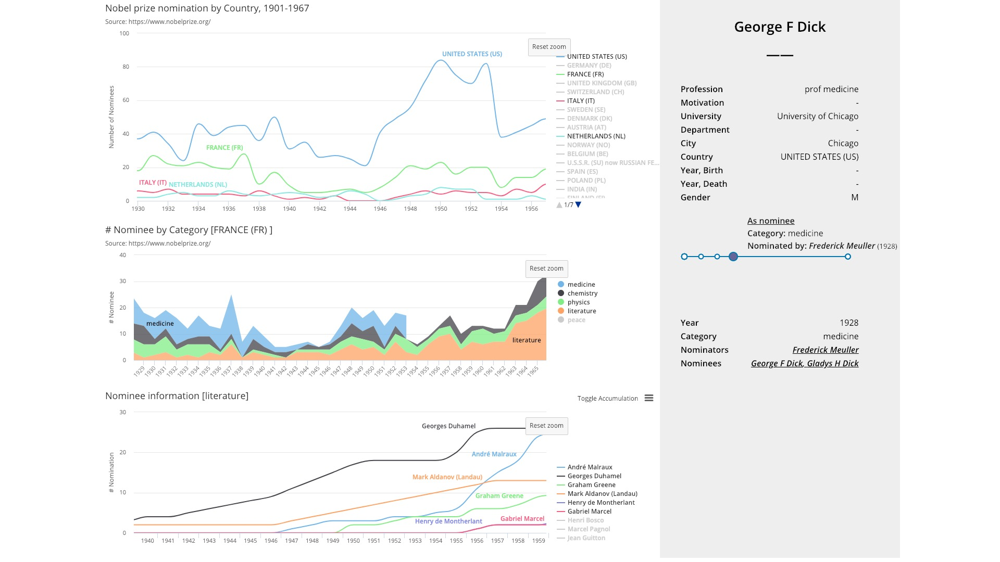

# 可视化与可视计算Final Project Report

主题：Visualize the Nobel Nomination Database

组员1：金奕成 1600017746

组员2：叶子博 1600017750

组员3：许广悦 1500012736（因身体原因休学）

日期：20190123

在我们的期末Project中，我们实现了诺贝尔奖提名数据集的可视化。在下面，我们将依次介绍我们的数据采集与整理、初期设想、代码实现等工作并展示最终效果。

## 一、数据采集与整理

我们的诺贝尔奖提名数据集从 https://www.nobelprize.org/nomination/redirector/?redir=archive/ 处获得。

观察网站，发现提名的 url 形如 https://old.nobelprize.org/nomination/archive/show.php?id=xxx ，获取到的HTML文件格式规范，适合批量处理。于是，我们编写了一个可多线程抓取所有id网页内容并分析储存的爬虫。抓取到的数据包括了1901年至1966年的几乎所有诺贝尔奖提名，共18347条有效数据。

每个提名项的主要信息如下：

- 提名年份

- 学科类别

- 被提名者个人信息

- - 姓名
  - 国家
  - ……

- 提名者个人信息

- - 姓名
  - 国家
  - ……

其中，对每个曾经提名或被提名过的人，也可通过形如[ https://old.nobelprize.org/nomination/archive/show_people.php?id=yyy](https://old.nobelprize.org/nomination/archive/show_people.php?id=yyy) 的url获得。同样的，使用爬虫将所有含有人员的页面爬下来，经过数据清洗和整理后共发现12510条有效数据。每条数据中包含的信息：

- 个人信息（同上）
- 获奖信息
- 作为被提名者的提名列表
- 作为提名者的提名列表

那么，我们就获得了提名数据集和人员数据集这两个数据集用于后续提取和可视化。

## 二、初期设想

获得数据之后，我们的想法是：这么大的数据量，我们需要层层筛选得到我们想要的那个数据。我们准备用分层结构展示，采用从上到下，从左到右的顺序布局。层与层之间的筛选使用国家、学科这种分类型的数据。

至于具体展现的数据，现有的数据似乎没有特别适合量化的数据，我们就自己合成了提名数量这一数据。这主要因为，通过提名数量可以看出很多信息：一个国家的科研文化综合水平；某个国家的学科水平分布；某一国家某一学科内的顶尖人才。另外，这三层语义关系层层递进，互相关联，符合互动可视化设计的原则。

下图是我们初期设想时画的草图。

### 左上：国家-提名数-时间折线图

这张图主要想展现不同国家的诺贝尔奖提名数量随时间的变化。这个指标可以部分衡量一个国家在不同时间下科技文化的相对水平。选用折线图，一方面是为了方便比较国家与国家之间在同一时间的差距，另一方面是为了方便比较同一国家在不同时间的变化。这里，不同的国家用不同颜色展示，方便区分。另外，由于国家众多，折线图右边附加了一个国家筛选器，按提名数量顺序排序，可以用来筛选留下自己想要看到的国家。在某个国家的曲线上悬停，可在弹出的消息框中查看此国家当年提名的具体次数。选择一个感兴趣的国家，我们可以在下一张图中进一步分析其不同学科的诺贝尔奖提名数量随时间的变化。

### 左中：特定国家-学科-提名数-时间-堆叠折线图

这张图主要想展现特定国家不同学科的诺贝尔奖提名数量随时间的变化。这个指标可以部分衡量特定国家在不同时间下不同学科之间的强弱。选用堆叠折线图，一方面是为了方便与上图进行对照，获取整体的趋势，另一方面，堆叠折线图也可以比较不同学科之间的差距。这里，不同的学科的区域用不同颜色展示，方便区分。不同的学科按固定顺序排序。在某个学科的曲线上悬停，可在弹出的消息框中查看提名的具体次数。选择一个感兴趣的学科，我们可以在下一张图中进一步分析特定国家特定学科被提名者的诺贝尔奖提名数时间的累计情况。

### 左下：特定国家-特定学科-被提名者-提名数-时间-累计折线图

这张图主要想展现特定国家特定学科被提名者的诺贝尔奖提名数时间的累计情况。这个指标可以衡量这个国家这门学科下的领军人才的“权威程度”。选用累计折线图，主要是考虑到一个人的成就是累加性的，是随时间累积的。这里，不同的人用不同颜色展示，方便区分。不同的人按总提名数量顺序排序。在某个人的曲线上悬停，可在弹出的消息框中查看提名的具体次数。选择一个感兴趣的人，我们可以在右边的表中进一步查看该人的个人信息和提名/被提名情况。

### 右：人员的具体信息

在左下图中选择一个人后就可以在这里查看个人的详细信息， 还有对其提名的时间轴展示。时间轴中按时间排序，圆圈的大小与当年获得的提名数量有关。在圆圈上悬停可弹出额外信息框，点击可在下方展开详细信息。

## 三、代码实现

如同前文所述，使用 Python 爬取网页并进行数据清洗之后，将得到的数据集按提名编号、人物与国家为索引保存为三个 JSON 文件。然后，在 JavaScript 脚本中加载 JSON 文件，在初始化图表时将初始化数据与图表绑定。运行时在各个图表中监测鼠标点击等事件，在回调函数中更新与其相链接的图表所绑定的数据。网页中使用三个依次链接的图表实现 drill-down 功能。在侧栏中使用经过少量修改的 [timeknots](https://github.com/alangrafu/timeknots) 库实现时间轴，在图表和时间轴处均使用自定义的 tooltip 覆盖原有的 tooltip 提高可读性。在侧栏的人名处设置超链接以实现不同人之间的跳转。

## 四、最终效果

最终，我们的实现效果如下。

可见，基本完成了最初设想的功能。

## 五、工作分工

数据采集：叶子博、金奕成

初期设想：金奕成、叶子博

代码实现：金奕成、叶子博

撰写报告等展示工作：叶子博、金奕成